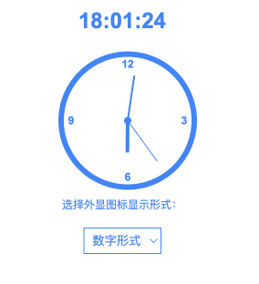

# 时间外显Chrome扩展

这是一个 [Chrome 浏览器扩展程序](https://chromewebstore.google.com/detail/easy-time/ajkjhejigonmfonbichldebnjlibdglj)，方便在浏览器工具栏上显示当前时间。

## 功能特点

1. 在 Chrome 浏览器工具栏上显示一个时间图标，支持数字形式和指针形式
2. 点击图标可以打开时钟面板和设置页面

##  截图

## 安装说明

1. 打开Chrome浏览器
2. 进入 `chrome://extensions/`
3. 开启右上角的 "开发者模式"
4. 点击 "加载已解压的扩展程序"
5. 解压release中的zip文件，然后选择

## 项目结构

- `manifest.json`: 扩展的配置文件
- `popup.html`: 弹出窗口的HTML结构
- `popup.js`: 弹出窗口的JavaScript逻辑
- `background.js`: 后台脚本，负责更新扩展图标
- `icons/`: 存放扩展图标文件的文件夹

## 技术实现

- 支持最新 manifest v3
- 使用Chrome Extensions API
- 使用HTML5 Canvas绘制扩展图标
- 使用localStorage存储用户设置
- 使用ImageData对象正确更新扩展图标
- 通过badgeText增大图标尺寸以提高时间可读性
